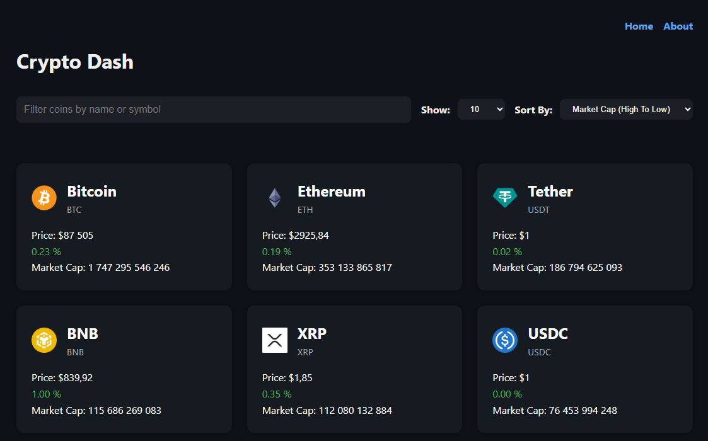

# 🚀 Crypto Dash

A React application to browse and search cryptocurrency data using the **CoinGecko API**.



## ✨ Features

- 🔍 Search cryptocurrencies
- 📊 View real-time price data
- ⚡ Fast development with Vite
- 📱 Responsive UI

## 🛠️ Tech Stack

- React
- Vite
- [CoinGecko API](https://www.coingecko.com/en/api)

## 📦 Installation

Clone the repository and install dependencies:

## Usage

Install dependencies

```bash
npm install
```

Run project

```bash
npm run dev
```

Build for production

```bash
npm run build
```

Run production build

```bash
npm run preview
```
